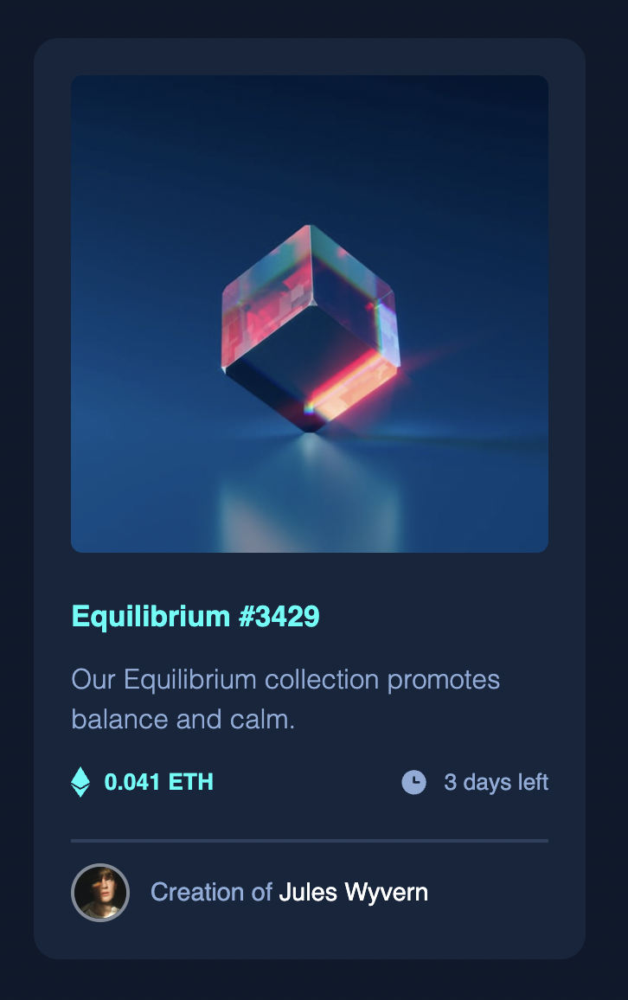
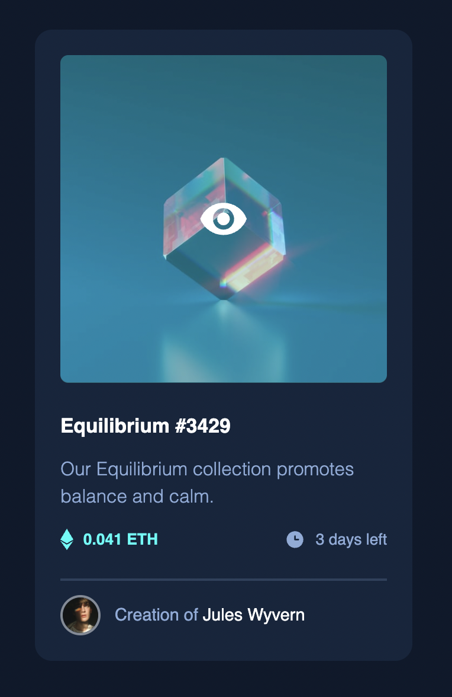

This is a solution to the Preview card Component

## Table of contents

- [Overview](#overview)
  - [Screenshot](#screenshot)
  - [Links](#links)
- [My process](#my-process)
  - [Built with](#built-with)
  - [What I learned](#what-i-learned)
  - [Continued development](#continued-development)
  - [Useful resources](#useful-resources)
- [Author](#author)
- [Acknowledgments](#acknowledgments)

## Overview

### Screenshot

### Links

- Live Site URL: https://nadiafrshlm.github.io/preview_card_component/

## My process

### Built with

- Semantic HTML5 markup
- CSS custom properties
- Flexbox
- Hover effect

### What I learned

How to overlay one image to another using

- position of an element (relative or absolute).
- opacity

### Continued development

Still want to focus on the layout of the page.
